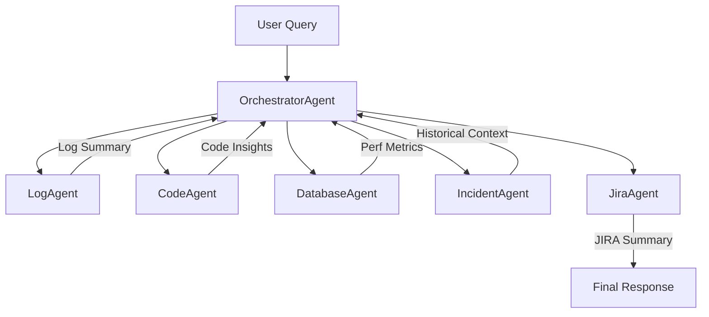

**Description**
A modular, LLM-powered multi-agent system for automating operational issue triage. This application, built with [CrewAI](https://github.com/joaomdmoura/crewAI), uses AI agents to analyze logs, inspect code, query performance metrics, check historical incidents, and create JIRA tickets — all from a natural language query.

---

## 🔍 Use Case
> "Why is task TID-12345 failing?"

The system will:
- Extract error details from logs.
- Retrieve and analyze relevant code.
- Pull performance metrics from a database.
- Search historical incidents.
- Create a JIRA ticket with all the findings.

---

## 🧠 Agents Overview

| Agent            | Purpose                                                      |
|------------------|--------------------------------------------------------------|
| **OrchestratorAgent** | Routes query to relevant agents based on keywords.         |
| **LogAgent**         | Extracts and classifies errors from logs.                   |
| **CodeAgent**        | Retrieves code snippets and suggests possible root causes. |
| **DatabaseAgent**    | Fetches task latency and runtime metrics.                  |
| **IncidentAgent**    | Looks up historical incidents for similar errors.          |
| **JiraAgent**        | Drafts and simulates a JIRA ticket creation.               |

---

## 🔧 Tooling Details

| Tool               | Used In         | Description                                      |
|--------------------|------------------|--------------------------------------------------|
| `log_tools.py`     | LogAgent         | Detects and classifies errors from log text.     |
| `code_tools.py`    | CodeAgent        | Matches code snippets to error keywords.         |
| `db_tools.py`      | DatabaseAgent    | Queries SQLite for timing and metrics.           |
| `incident_tools.py`| IncidentAgent    | Searches a CSV of past incident descriptions.    |
| `jira_tools.py`    | JiraAgent        | Simulates JIRA ticket generation.                |

---

## 📁 Project Structure

```
multi_agent_ops_ai/
├── main.py                         # Entry point for running agentic query
├── agents/
│   ├── orchestrator_agent.py      # Orchestrator logic
│   ├── log_agent.py               # Handles log parsing
│   ├── code_agent.py              # Handles code correlation
│   ├── database_agent.py          # Retrieves metrics from SQLite
│   ├── incident_agent.py          # Checks incident history
│   └── jira_agent.py              # Drafts JIRA ticket
├── tools/
│   ├── log_tools.py               # Log classification functions
│   ├── code_tools.py              # Semantic search / pattern match
│   ├── db_tools.py                # SQLite access utility
│   ├── incident_tools.py          # Incident CSV parser
│   └── jira_tools.py              # Ticket summarization logic
├── data/
│   ├── logs/                      # Sample .log files
│   ├── codebase/                  # Example .py or .java snippets
│   ├── metrics.db                 # SQLite DB for task metrics
│   └── incidents.csv              # Incident history dataset
├── config/
│   └── config.py                  # Configuration values
└── README.md
```

---

## 🔄 Workflow Diagram



---

## 🚀 Sample Execution
```bash
$ python main.py
[System] Received query: Why is task TID-12345 failing?
[Orchestrator] Plan: ['log', 'code', 'jira']
...
[System] Final response:
Log Summary: Detected exception: ...
Code Analysis: Found 2 relevant code snippet(s)...
JIRA Ticket Created: [JIRA Ticket] Task: TID-12345 ...
```

---

## ✅ Requirements
- Python 3.10+
- pandas
- sqlite3 (std lib)

Install dependencies:
```bash
pip install pandas
```

---

## 📌 Credits
Inspired by [Anubha Bhaik’s blog](https://medium.com/@anubha.bhaik) and adapted with CrewAI.

---

## 📄 License
MIT License
